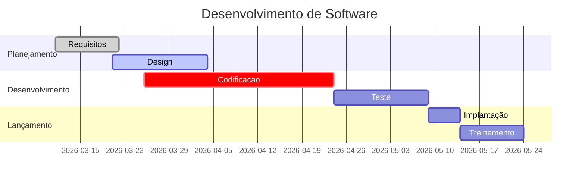

 

```mermaid
   gantt
   %%%comentário
   %%%Definir titulo principal
   title Desenvolvimento de Software
   %%%Definir o formato data (Ano-Mês-Dia)
   dateFormat YYYY-MM-DD

   %%%Criação do agrupamento visual para as tarefas iniciais
   section Planejamento
   %%%'done': Tarefa concluída(fica cinza). 'req' é o ID da
  Requisitos:done, req, 2026-03-11, 10d
  %%%'active' Tarefa em andamento
  Design :active,des, 2026-03-20, 15d

  %%%Criação do segundo bloco
  section Desenvolvimento
  %%%'crit' Define como tarefa critica (cor vermelha ou destaque)
  Codificacao : crit, dev, 2026-03-25, 30d

  %%%'after dev' : Realiza a tarefa quando a tarefa dev terminar
  Teste   :test,after dev,15d

  section Lançamento
  Implantação: dep, after test, 5d
  Treinamento: tra, after dep, 10d
  


```
